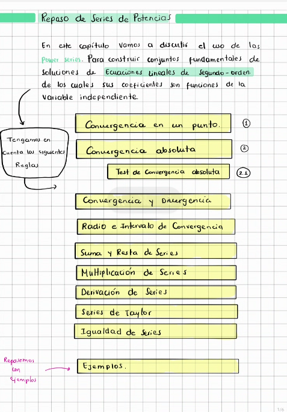

<a href="index.html" class="back-btn-rose"><i class="bi bi-arrow-left-short"></i>
Regresar al índice</a>

::::::::::::::::::::: cards-slider
:::: {#p1 .page-group}
::: notebook-card
# Maria José - Notebook

{fig-align="left" width="100%"}

<a href="#p2" class="btn-nav btn-next"><i class="bi bi-arrow-right-short"></i></a>
:::
::::

:::: {#p2 .page-group}
::: notebook-card
# Índice

{fig-align="left" width="487"}

<a href="#p1" class="btn-nav btn-prev"><i class="bi bi-arrow-left-short"></i></a>
<a href="#p3" class="btn-nav btn-next"><i class="bi bi-arrow-right-short"></i></a>
:::
::::

:::: {#p3 .page-group}
::: notebook-card
# Convergencia en un punto

Una [power serie]{style="color: blue;"}
$\sum_{n=0}^{\infty} a_n (x-x_0)^n$ converge en un punto $x$ sí:

$$\lim_{m \to \infty} \sum_{n=0}^{m} a_n (x-x_0)^n$$

existe para ese $x$.

La serie con certeza converge para $x=x_o$ de ser así esta puede
converger para todo $\forall$ x, o puede converger para algunos valores
de $x$ y no para otros.

<a href="#p2" class="btn-nav btn-prev"><i class="bi bi-arrow-left-short"></i></a>
<a href="#p4" class="btn-nav btn-next"><i class="bi bi-arrow-right-short"></i></a>
:::
::::

:::: {#p4 .page-group}
::: notebook-card
# Convergencia Absoluta

Las [power series]{style="color: blue;"} convergen absolutamente  en un punto $x$ si:

$$\sum_{n=0}^{\infty} |a_n (x-x_0)^n| = \sum_{n=0}^{\infty} |a_n| |x-x_0|^n$$

Estas dos anteriores [power series]{style="color: blue;"} convergen.

### PROPIEDAD
- Si las [POWER SERIES]{style="color: pink;"} convergen de manera absoluta, implica que las [POWER SERIES]{style="color: pink;"} convergen.
(Pero el contrario no es necesariamente real!)

<a href="#p3" class="btn-nav btn-prev"><i class="bi bi-arrow-left-short"></i></a>
<a href="#p5" class="btn-nav btn-next"><i class="bi bi-arrow-right-short"></i></a>
:::
::::

:::: {#p5 .page-group}
::: notebook-card
# Test de Convergencia absoluta

Uno de los test más útiles para la [Convergencia Absoluta]{style="color: pink;"} de una power serie, es el Radio Test.

-  Si $a_n \neq 0$ y sí para un valor fijo de x, tengo:

$$
\lim_{n \to \infty} \left| \frac{a_{n+1}(x - x_0)^{n+1}}{a_n(x - x_0)^n} \right| = |x - x_0| \lim_{n \to \infty} \left| \frac{a_{n+1}}{a_n} \right| = \bbox[yellow, 2pt]{|x - x_0|L}
$$

Así puedo decir que:

-  Las power series convergen absolutamente en ese valor de x SÍ $|x - x_0|L < 1$

-  Las power series divergen SÍ $|x - x_0|L > 1$.

-  Pero si $|x - x_0|L = 1$ el TEST DE RADIO no concluye. 

<a href="#p4" class="btn-nav btn-prev"><i class="bi bi-arrow-left-short"></i></a>
<a href="#p6" class="btn-nav btn-next"><i class="bi bi-arrow-right-short"></i></a>
:::
::::

:::: {#p6 .page-group}
::: notebook-card

# Propiedad de Convergencia

* Si la serie de potencias $\sum_{n=0}^{\infty} a_n (x - x_0)^n$ **converge** en $x = x_1$, entonces converge absolutamente para:
    $$\bbox[#fff0f5, 5pt]{|x - x_0| < |x_1 - x_0|}$$

* Si **diverge** en $x = x_1$, entonces diverge para:
    $$|x - x_0| > |x_1 - x_0|$$

  
  

    
  

  
    ¡Zona de Convergencia Absoluta!
  

<a href="#p5" class="btn-nav btn-prev"><i class="bi bi-arrow-left-short"></i></a>
<a href="#p7" class="btn-nav btn-next"><i class="bi bi-arrow-right-short"></i></a>
:::
::::

:::: {#p7 .page-group}
::: notebook-card
# Series de Taylor

Una función $f(x)$ suave se puede representar como:
$$f(x) = \sum_{n=0}^{\infty} \frac{f^{(n)}(x_0)}{n!} (x-x_0)^n$$

<a href="#p6" class="btn-nav btn-prev"><i class="bi bi-arrow-left-short"></i></a>
<a href="#p8" class="btn-nav btn-next"><i class="bi bi-arrow-right-short"></i></a>
:::
::::

:::: {#p8 .page-group}
::: notebook-card
# Igualdad de Series

Dos [power series]{style="color: blue;"} son iguales $\iff$ sus
coeficientes son idénticos para todo $n$:
$$\sum a_n (x-x_0)^n = \sum b_n (x-x_0)^n \implies a_n = b_n$$

<a href="#p7" class="btn-nav btn-prev"><i class="bi bi-arrow-left-short"></i></a>
<a href="#p9" class="btn-nav btn-next"><i class="bi bi-arrow-right-short"></i></a>
:::
::::

:::: {#p9 .page-group}
::: notebook-card
# Ejercicios

Para cada uno de los ejercicios del 1 al 6, determine el Radio de
Convergencia:

1- $\quad \sum_{n=0}^\infty (x-3)^n$

3- $\quad \sum_{n=0}^\infty \frac{x^{2n}}{n!}$

Determine la Serie de Taylor en $x_o$:

8- $\quad e^x, \quad x_o =0$

10- $\quad x^2, \quad x_o =-1$

<a href="#p8" class="btn-nav btn-prev"><i class="bi bi-arrow-left-short"></i></a>
:::
::::
:::::::::::::::::::::
